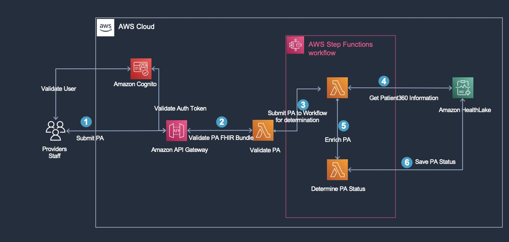

# FHIR Validation and Prior Authorization Adjudication API

A serverless workflow to accept FHIR bundle prior authorization request and validates fhir resource and then executes prior authorization rules input payload as well as data received from healthlake and then saves prior authorization status into healthlake.
## Design



## Installation
 If you do not have maven or java , please ensure that you are under root project folder and execute following command.
   sh setupEnv.sh; 

### Deploy the Application using SAM CLI

The template can be deployed via web console or via CLI.

### SAM CLI

Install the AWS Serverless Application Model (SAM) CLI using these [instructions](https://docs.aws.amazon.com/serverless-application-model/latest/developerguide/serverless-sam-cli-install.html)

```sh
git clone https://gitlab.aws.dev/manishpl/fhir-auth-validation.git
cd priorauth-fhir-api/
```

Build the application using SAM

```sh
sam build
```

Deploy the application using the guided process

```sh
sam deploy --guided
# Replace MY_VALUE and MY_ACCOUNT_ID with proper resource names
Configuring SAM deploy
======================

        Looking for config file [samconfig.toml] :  Not found

        Setting default arguments for 'sam deploy'
        =========================================
        Stack Name [auth-app]: priorauth-fhir-validation-api
        AWS Region [us-west-2]: us-west-2
        Parameter CognitoUserPoolName [FHIRUserPool]: FHIRUserPool
        #Shows you resources changes to be deployed and require a 'Y' to initiate deploy
        Confirm changes before deploy [Y/n]: Y
        #SAM needs permission to be able to create roles to connect to the resources in your template
        Allow SAM CLI IAM role creation [Y/n]: Y
        #Preserves the state of previously provisioned resources when an operation fails
        Disable rollback [Y/n]: n
        Save arguments to configuration file [Y/n]: Y
        SAM configuration file [samconfig.toml]:samconfig.toml
        SAM configuration environment [default]: default
Previewing CloudFormation changeset before deployment
======================================================
Deploy this changeset? [y/N]: y
```

Please note that As part of the deployment Healthlake Datastore and Cognito userpool will be created. Creation of Healthlake 30 minutes approximately due to which SAM deployment will be in the waiting state and it may timeout but rest assured all your resource will be created. please login to console and verify if resources created as per architecture diagram. 

### Post Deployment Steps
 #### Ingest Clinical Document to Healthlake
   Navigate to Amazon Healthlake using console link https://us-west-2.console.aws.amazon.com/healthlake/home?region=us-west-2#/  . please ensure to update region to appropriate region and then click on view datastore.
   Navigate to Datastore that was created by deployment process and then click on Run query.
   you will see following screen. Please select Datastore id that was created,select query type as Create and Resource type as DocumentReference.
    

   Copy the content from DocumentReference.json located under docs folder file and paste into Request body and click on Run query.
   you will see following message and response body as show below. This has Ingested clinical document to the Healthlake which will be used as part of Prior Authorization Validation process.
     
  #### Create User in cognito user pool and generate token 
     Navigate to cognito userpool and ensure that you user user pool id for the userpool that was created as part of deployment process
     Navigate to app integration tab for the user pool and  copy the clint id
     update provision-user.py located under root folder of this project with appropriate user and and email address if you wish to otherwise leave it to default
     run following command from root , below command will also generate token which will valid for 1 hour and can be used for invoking API
        python provision-user.py <<user pool id>> <<client id>>
     if you need to regenerate token again , please update initi-auth.py file with user id and password and run following command
        python initi-auth.py
  #### Summit Prior Authorization FHIR bundle to the workflow for validation and detemination
    update post-test-data.sh  with token that was generated above and API endpoint and then execute following command
      sh post-test.data.sh
    Alternatively you can execute api using tool like postman , please ensure to have header as Content-Type: application/fhir+json and Authorization with appropriate token.
    Outcome should 201 status code with appropriate message in the response body.  

